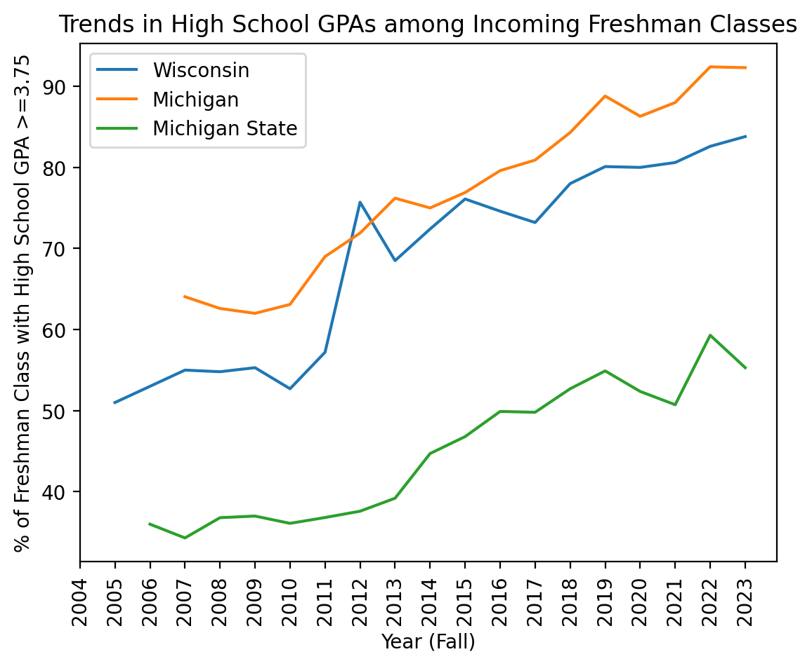

# Trends in High School GPAs (Big Ten Common Data Set)

Using self-reported Common Data Set figures from Big Ten universities, this analysis plots the share of each incoming freshman class with a high school GPA of 3.75 or higher at Wisconsin, Michigan, and Michigan State — and that share rises substantially at all three schools over the ~20 years of available data.



## Context

This is a **guided MicroProject** from the University of Illinois' [Data Science DISCOVERY](https://discovery.cs.illinois.edu/microproject/trends-in-high-school-gpas/) curriculum, not independent research. The notebook structure, the prompts, the test cases, and the dataset all come from the course:

- The dataset was **compiled by the course staff** in January 2025 from the published Common Data Sets of Big Ten universities.
- The **plotting code in Part 3 was provided by the course** — the notebook explicitly hands it to the student ahead of the data-visualization module. `make_chart.py` in this repo wraps that same code so the figure can be saved as a file; the plotting logic is not mine.

My own work in the notebook is the data loading and row-selection code in Parts 1–2 and the column choices in Part 3.

## Dataset

The [Common Data Set](https://commondataset.org/) (CDS) is an annual report published by most U.S. colleges and universities using standardized item definitions. Among other things, each school reports the percentage of enrolled, first-time, first-year students falling into cumulative high school GPA bands (=4.00, ≥3.75, ≥3.50, … ≥0.00), plus the class average GPA and the percentage of students for whom a GPA was actually reported.

- **Source:** `https://waf.cs.illinois.edu/discovery/cds-high-school-gpas.csv`
- **Shape:** 186 rows × 13 columns — one row per school-year
- **Columns:** `School`, `Year (Fall)`, `=4.00`, `>=3.75`, `>=3.50`, `>=3.25`, `>=3.00`, `>=2.50`, `>=2.00`, `>=1.00`, `>=0.00`, `Avg.`, `%StudentsReportedGPAs`
- **Years:** Fall 1998 through Fall 2024 overall, though coverage varies by school
- **Schools (10):** UCLA, Indiana (Bloomington), University of Iowa, University of Michigan, Michigan State, University of Oregon, Purdue, USC, University of Washington (Seattle), University of Wisconsin-Madison

Per-school coverage is uneven — Michigan State, Michigan, and Iowa each have 25 rows reaching back to the late 1990s, while UCLA has only 8 rows (2017–2024) and Purdue 11 (2013–2023).

## Analysis

The notebook performs a small, concrete set of steps:

1. **Load** the CSV directly from the course URL into a pandas DataFrame with `pd.read_csv`.
2. **Rank** the ten school-years with the highest percentage of freshmen holding a 4.00 GPA (`df.nlargest(10, "=4.00")`).
3. **Subset by school** using boolean row selection, producing one DataFrame each for Wisconsin (24 rows), Michigan (25 rows), and Michigan State (25 rows).
4. **List unique schools** with `df["School"].unique()` to find the exact spelling used in the data.
5. **Choose the plot axes** — `Year (Fall)` on x, `>=3.75` on y — and render the three subsets as overlaid line plots with the course-provided code, labeling the axes, title, and legend.

No aggregation, cleaning, imputation, or statistical modeling is performed; the analysis is descriptive.

## Findings

All numbers below are read directly from the notebook output.

- **All three schools trend upward.** For the ≥3.75 band: Wisconsin goes from 51.0% (2005) to 83.8% (2023); Michigan from 64.05% (2007) to 92.3% (2023); Michigan State from 36.0% (2006) to 55.3% (2023) — increases of roughly 33, 28, and 19 percentage points respectively.
- **The ordering is stable, with one exception.** Michigan sits above Wisconsin, which sits well above Michigan State, in nearly every year. The one crossover is 2012, when Wisconsin (75.7%) exceeded Michigan (71.9%) before falling back to 68.5% in 2013 against Michigan's 76.2%.
- **Wisconsin's jump is concentrated around 2011–2012**, moving from 52.7% (2010) to 57.2% (2011) to 75.7% (2012) — a much sharper move than the gradual drift seen elsewhere in its series.
- **Michigan State's line is the most volatile at the end**, dropping to 50.73% (2021), spiking to 59.30% (2022), then falling to 55.30% (2023).
- **Top 4.00 percentages are dominated by two schools.** The ten highest `=4.00` rows in the whole dataset belong only to UCLA (peaking at 59.10% in 2022) and Wisconsin (peaking at 48.20% in 2022).
- **Class average GPAs rise too.** Wisconsin's `Avg.` moves from 3.60 (2000) to 3.90 (2023); Michigan State's from 3.40 (1998) to 3.80 (2023).

## Data limitations

Two issues in the data limit how far these comparisons can be pushed:

- **Missing values in earlier years.** 28 of 186 rows have no `>=3.75` value at all. Wisconsin's GPA-band columns are blank for 2000–2004, Michigan's for 1998–2005, and Michigan State's for 1998–2004 — those years report only the coarser `>=3.00` and below bands. The `=4.00` column is blank for these three schools before 2019. As a result, each line in the chart starts at a different year (Wisconsin 2005, Michigan 2007, Michigan State 2006), and the apparent "start" of each trend is an artifact of reporting, not of admissions.
- **`%StudentsReportedGPAs` varies across schools and years.** Each percentage is computed only over the students whose high school GPA the school actually had on file. That denominator moves: Wisconsin ranges from 78% to 98% across its rows, Michigan State from 75% to 98%, Michigan from 90% to 98%; one Michigan State row (1999) records the value as `*` rather than a number. A school-year covering 75% of the class is not directly comparable to one covering 98%, and a change in reporting coverage between two adjacent years can shift the reported percentage without any change in the underlying class.

Beyond the data itself, GPAs are self-reported by institutions, weighting and scale conventions differ between high schools, and the dataset contains no information about grade inflation, test-optional policy shifts, or changes in applicant pools — all of which plausibly contribute to the observed trend but cannot be separated with this data alone.

## Tech stack

Python 3, pandas 2.2.3, matplotlib, Jupyter. The course autograder runs via GitHub Actions using `jupyter2pytest` and `pytest`.

## How to run

```bash
pip install -r microproject-01-trends-in-high-school-gpas/requirements.txt

# Open and run the notebook
jupyter notebook microproject-01-trends-in-high-school-gpas/microproject-01-trends-in-high-school-gpas.ipynb

# Or just regenerate the chart above
python make_chart.py   # writes images/gpa-trends.png
```

Both the notebook and the script fetch the CSV over the network, so an internet connection is required.
